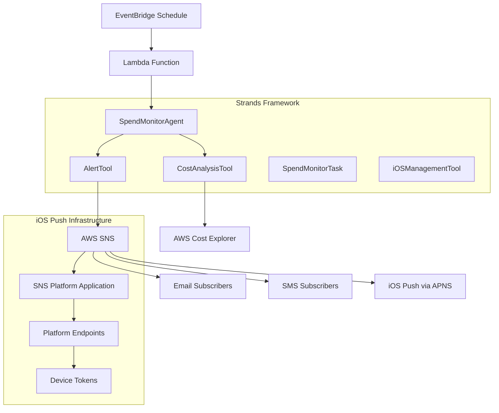
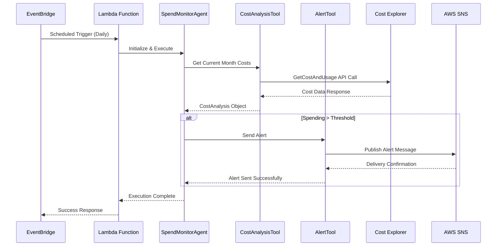

# Design Document

## Overview

The AWS Spend Monitor Agent is a Strands-based AI agent that autonomously monitors AWS spending and generates alerts when costs exceed predefined thresholds. The agent leverages AWS Cost Explorer for cost data retrieval, AWS SNS for notifications, and AWS EventBridge for scheduled execution.

The design follows the AWS Strands framework patterns with clear separation of concerns through Tools, Tasks, and Agent orchestration. The system is designed to be configurable, resilient, and extensible for future enhancements.

## Architecture

### High-Level Architecture



### Component Interaction Flow



## Components and Interfaces

### 1. SpendMonitorAgent

**Purpose:** Main orchestrator that coordinates cost monitoring and alerting workflow.

**Key Methods:**
- `initialize()`: Registers tools and tasks
- `execute()`: Main monitoring logic
- `analyzeCosts()`: Delegates to CostAnalysisTool
- `sendAlert()`: Delegates to AlertTool

**Configuration Interface:**
```typescript
interface SpendMonitorConfig extends AgentConfig {
  spendThreshold: number;      // Dollar amount threshold
  snsTopicArn: string;        // SNS topic for alerts
  checkPeriodDays: number;    // Monitoring frequency
}
```

### 2. CostAnalysisTool

**Purpose:** Encapsulates AWS Cost Explorer interactions for retrieving and processing cost data.

**Key Methods:**
- `getCurrentMonthCosts()`: Retrieves month-to-date spending
- `formatCostData()`: Processes raw API response
- `calculateProjections()`: Estimates monthly totals

**Output Interface:**
```typescript
interface CostAnalysis {
  totalCost: number;
  serviceBreakdown: { [service: string]: number };
  period: { start: string; end: string };
  projectedMonthly: number;
}
```

### 3. AlertTool

**Purpose:** Handles notification delivery via AWS SNS with formatted alert messages for multiple channels.

**Key Methods:**
- `sendSpendAlert()`: Sends formatted alert to all channels
- `formatAlertMessage()`: Creates human-readable message for email/SMS
- `formatIOSPayload()`: Creates APNS-compatible JSON payload
- `retryDelivery()`: Handles delivery failures
- `validateChannels()`: Checks available notification channels

**Alert Message Formats:**
- **Email/SMS**: Human-readable text with cost breakdown
- **iOS Push**: JSON payload with badge, alert, and custom data
- Service breakdown (top 5 services)
- Projected monthly total
- Time period covered

### 4. iOSManagementTool

**Purpose:** Manages iOS device registration and APNS platform configuration.

**Key Methods:**
- `registerDevice()`: Registers new iOS device token
- `updateDeviceToken()`: Updates existing device registration
- `removeInvalidTokens()`: Cleans up expired/invalid tokens
- `validateAPNSConfig()`: Checks APNS certificate validity
- `createPlatformEndpoint()`: Creates SNS platform endpoint for device

### 5. SpendMonitorTask

**Purpose:** Represents the monitoring workflow as a structured task unit.

**Key Methods:**
- `execute()`: Task execution logic
- `validate()`: Pre-execution validation
- `getMetadata()`: Task information

## Data Models

### CostAnalysis Model

```typescript
interface CostAnalysis {
  totalCost: number;                           // Current month-to-date total
  serviceBreakdown: { [service: string]: number }; // Cost by AWS service
  period: {
    start: string;                             // Period start date (ISO)
    end: string;                               // Period end date (ISO)
  };
  projectedMonthly: number;                    // Projected full month cost
  currency: string;                            // Currency code (USD)
  lastUpdated: string;                         // Data retrieval timestamp
}
```

### AlertContext Model

```typescript
interface AlertContext {
  threshold: number;                           // Configured threshold
  exceedAmount: number;                        // Amount over threshold
  percentageOver: number;                      // Percentage over threshold
  topServices: ServiceCost[];                  // Top cost-driving services
  alertLevel: 'WARNING' | 'CRITICAL';         // Alert severity
}

interface ServiceCost {
  serviceName: string;
  cost: number;
  percentage: number;                          // Percentage of total cost
}
```

### Configuration Model

```typescript
interface SpendMonitorConfig extends AgentConfig {
  spendThreshold: number;                      // Alert threshold in USD
  snsTopicArn: string;                        // SNS topic ARN
  checkPeriodDays: number;                    // Check frequency (days)
  region: string;                             // AWS region
  retryAttempts: number;                      // Max retry attempts
  minServiceCostThreshold: number;            // Min cost to show in breakdown
  iosConfig?: iOSPushConfig;                  // iOS push notification config
}

interface iOSPushConfig {
  platformApplicationArn: string;             // SNS platform application ARN
  apnsCertificatePath?: string;               // Path to APNS certificate
  apnsPrivateKeyPath?: string;                // Path to APNS private key
  bundleId: string;                           // iOS app bundle identifier
  sandbox: boolean;                           // Use APNS sandbox environment
}
```

### iOS Push Notification Models

```typescript
interface iOSDeviceRegistration {
  deviceToken: string;                        // APNS device token
  platformEndpointArn: string;               // SNS platform endpoint ARN
  userId?: string;                            // Optional user identifier
  registrationDate: string;                  // Registration timestamp
  lastUpdated: string;                       // Last update timestamp
  active: boolean;                           // Device active status
}

interface APNSPayload {
  aps: {
    alert: {
      title: string;                          // Notification title
      body: string;                           // Notification body
      subtitle?: string;                      // Optional subtitle
    };
    badge: number;                            // App badge count
    sound: string;                            // Notification sound
    'content-available': number;              // Background update flag
  };
  customData: {
    spendAmount: number;                      // Current spending
    threshold: number;                        // Configured threshold
    exceedAmount: number;                     // Amount over threshold
    topService: string;                       // Highest cost service
    alertId: string;                          // Unique alert identifier
  };
}
```

## Error Handling

### Error Categories and Responses

1. **AWS API Errors**
   - Cost Explorer rate limiting: Exponential backoff retry
   - Authentication failures: Log and fail fast
   - Service unavailable: Retry with circuit breaker

2. **Configuration Errors**
   - Invalid SNS topic: Fail deployment
   - Invalid threshold: Use default value with warning
   - Missing permissions: Clear error message

3. **Notification Failures**
   - SNS delivery failure: Retry up to 3 times
   - Topic not found: Log error and continue monitoring
   - Message formatting error: Send simplified alert

4. **iOS Push Notification Errors**
   - Invalid device token: Remove from endpoint and log
   - APNS certificate expired: Log critical error, continue with other channels
   - Platform application not found: Log error and skip iOS notifications
   - Payload too large: Truncate message and retry
   - APNS feedback service errors: Process feedback and clean up invalid tokens

5. **Device Management Errors**
   - Duplicate device registration: Update existing registration
   - Invalid bundle ID: Reject registration with clear error
   - Token format validation: Validate hex format and length
   - Endpoint creation failure: Log error and retry once

### Retry Strategy

```typescript
interface RetryConfig {
  maxAttempts: number;        // Default: 3
  baseDelay: number;          // Default: 1000ms
  maxDelay: number;           // Default: 30000ms
  backoffMultiplier: number;  // Default: 2
}
```

### Logging Strategy

- **INFO**: Normal operations, cost checks, successful alerts
- **WARN**: Threshold exceeded, retry attempts, configuration issues
- **ERROR**: API failures, notification failures, unexpected errors
- **DEBUG**: Detailed cost breakdowns, API responses (non-production)

## Testing Strategy

### Unit Testing

1. **CostAnalysisTool Tests**
   - Mock Cost Explorer responses
   - Test cost calculation logic
   - Validate error handling for API failures
   - Test date range calculations

2. **AlertTool Tests**
   - Mock SNS client
   - Test message formatting for all channels
   - Test iOS payload generation
   - Validate retry logic
   - Test delivery confirmation handling

3. **iOSManagementTool Tests**
   - Mock SNS platform operations
   - Test device token validation
   - Test endpoint creation and management
   - Validate APNS payload formatting
   - Test error handling for invalid tokens

4. **SpendMonitorAgent Tests**
   - Mock tool dependencies
   - Test orchestration logic with iOS notifications
   - Validate configuration handling
   - Test error propagation across channels

### Integration Testing

1. **AWS Service Integration**
   - Test with real Cost Explorer API (using test account)
   - Validate SNS message delivery
   - Test IAM permissions

2. **End-to-End Testing**
   - Deploy to test environment
   - Trigger scheduled execution
   - Verify alert delivery
   - Test configuration changes

### Performance Testing

1. **Cost Explorer API Performance**
   - Measure API response times
   - Test with large cost datasets
   - Validate timeout handling

2. **Lambda Performance**
   - Monitor execution duration
   - Test memory usage
   - Validate cold start performance

### Test Data Strategy

```typescript
interface TestCostData {
  scenarios: {
    underThreshold: CostAnalysis;
    overThreshold: CostAnalysis;
    exactThreshold: CostAnalysis;
    multipleServices: CostAnalysis;
    singleService: CostAnalysis;
  };
}
```

## Deployment Architecture

### Infrastructure Components

1. **Lambda Function**
   - Runtime: Node.js 18.x
   - Memory: 512 MB (increased for iOS processing)
   - Timeout: 5 minutes
   - Environment variables for configuration

2. **EventBridge Rule**
   - Schedule: Daily at 9 AM UTC
   - Target: Lambda function
   - Retry policy for failed executions

3. **SNS Topic**
   - Topic for alert delivery
   - Configurable subscriptions (email, SMS)
   - Dead letter queue for failed deliveries

4. **SNS Platform Application (iOS)**
   - APNS platform application for iOS push notifications
   - Configured with Apple Developer certificates
   - Supports both sandbox and production environments
   - Automatic endpoint management

5. **DynamoDB Table (Optional)**
   - Store iOS device registrations
   - Track device token validity
   - Manage user preferences
   - Enable device management API

6. **API Gateway (Optional)**
   - REST API for device registration
   - Endpoints for token management
   - Authentication and authorization
   - Rate limiting and throttling

7. **IAM Roles and Policies**
   - Lambda execution role
   - Cost Explorer read permissions
   - SNS publish permissions
   - SNS platform application management
   - DynamoDB read/write permissions (if using device storage)

### Configuration Management

```typescript
// Environment Variables
const config: SpendMonitorConfig = {
  spendThreshold: parseFloat(process.env.SPEND_THRESHOLD || '10'),
  snsTopicArn: process.env.SNS_TOPIC_ARN!,
  checkPeriodDays: parseInt(process.env.CHECK_PERIOD_DAYS || '1'),
  region: process.env.AWS_REGION || 'us-east-1',
  retryAttempts: parseInt(process.env.RETRY_ATTEMPTS || '3'),
  minServiceCostThreshold: parseFloat(process.env.MIN_SERVICE_COST || '1'),
  iosConfig: process.env.IOS_PLATFORM_APP_ARN ? {
    platformApplicationArn: process.env.IOS_PLATFORM_APP_ARN!,
    bundleId: process.env.IOS_BUNDLE_ID || 'com.example.spendmonitor',
    sandbox: process.env.APNS_SANDBOX === 'true'
  } : undefined
};
```

### iOS Setup Requirements

1. **Apple Developer Account Setup**
   - Create App ID with Push Notifications capability
   - Generate APNS certificate (development or production)
   - Download certificate and private key

2. **AWS SNS Platform Application Setup**
   ```bash
   # Create APNS platform application
   aws sns create-platform-application \
     --name "SpendMonitorAPNS" \
     --platform APNS \
     --attributes PlatformCredential="$(cat apns-cert.pem)",PlatformPrincipal="$(cat apns-key.pem)"
   ```

3. **Device Registration Process**
   - iOS app obtains device token from APNS
   - App calls registration API with device token
   - System creates SNS platform endpoint
   - Endpoint is subscribed to spend alert topic

4. **Testing iOS Notifications**
   - Use APNS sandbox environment for development
   - Test with real iOS device and valid certificate
   - Validate payload format and delivery
   - Monitor APNS feedback service for invalid tokens

### Monitoring and Observability

1. **CloudWatch Metrics**
   - Execution duration
   - Success/failure rates
   - Cost check frequency
   - Alert generation count

2. **CloudWatch Logs**
   - Structured logging with correlation IDs
   - Cost analysis results
   - Alert delivery status
   - Error details and stack traces

3. **CloudWatch Alarms**
   - Lambda function errors
   - Execution timeouts
   - SNS delivery failures

This design provides a robust, scalable, and maintainable solution for AWS spend monitoring using the Strands framework while following AWS best practices for serverless applications.