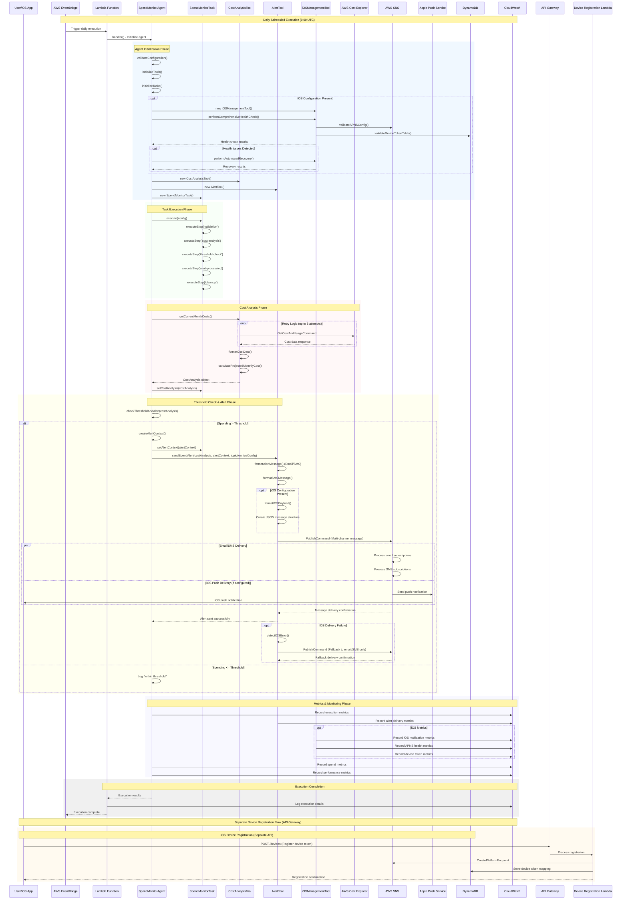

# FinOps AI Agent - Workflow Sequence Diagram

## Architecture Overview

The FinOps AI Agent is a comprehensive AWS-native serverless application that monitors spending and sends multi-channel alerts. It leverages AWS Strands AI framework for intelligent orchestration and includes advanced iOS push notification capabilities.

## Sequence Diagram

## Component Interaction Details

### 1. **Infrastructure Layer (AWS CDK)**
- **EventBridge Rule**: Triggers daily execution at 9:00 UTC
- **Lambda Function**: Hosts the Strands AI agent
- **SNS Topics**: Handle multi-channel alert delivery
- **DynamoDB Table**: Stores iOS device tokens
- **API Gateway**: Provides device registration endpoints
- **CloudWatch**: Monitoring, metrics, and alarms

### 2. **AI Agent Layer (AWS Strands Framework)**
- **SpendMonitorAgent**: Main orchestrator extending Strands Agent base class
- **SpendMonitorTask**: Task that manages execution workflow with progress tracking
- **Tool Registration**: Automated registration of tools with the agent framework

### 3. **Tools Layer**
- **CostAnalysisTool**: Interfaces with AWS Cost Explorer API
- **AlertTool**: Handles multi-channel alert formatting and delivery
- **iOSManagementTool**: Manages iOS push notifications and device health

### 4. **Data Flow**
1. **Cost Collection**: Real-time AWS spending data from Cost Explorer
2. **Analysis**: Current vs. projected spending calculations
3. **Decision Making**: Threshold comparison and alert level determination
4. **Multi-Channel Delivery**: Email, SMS, and iOS push notifications
5. **Metrics Collection**: Performance and delivery metrics to CloudWatch

### 5. **Error Handling & Resilience**
- **Retry Logic**: Exponential backoff for AWS API calls
- **iOS Fallback**: Automatic fallback to email/SMS if iOS delivery fails
- **Health Monitoring**: Comprehensive health checks for all components
- **Automated Recovery**: Self-healing capabilities for common issues

### 6. **Security & Compliance**
- **IAM Roles**: Least privilege access for all components
- **API Key Protection**: Rate-limited device registration API
- **APNS Certificate Management**: Automated certificate health monitoring
- **Data Encryption**: At-rest and in-transit encryption for all data

## Key Features

### **Intelligent Orchestration**
- AWS Strands framework provides AI-driven task orchestration
- Progress tracking and step-by-step execution monitoring
- Automatic error recovery and retry logic

### **Multi-Channel Alerting**
- **Email**: Rich formatted alerts with spending breakdown
- **SMS**: Concise alerts optimized for mobile
- **iOS Push**: Native push notifications with custom data

### **Advanced iOS Integration**
- Device token management with DynamoDB storage
- APNS certificate health monitoring with expiration alerts
- Automatic fallback mechanisms for delivery failures
- Comprehensive device lifecycle management

### **Operational Excellence**
- CloudWatch dashboard with 20+ custom metrics
- Automated alarms for system health monitoring
- Comprehensive logging and distributed tracing
- Performance optimization with caching and batching

This architecture provides a robust, scalable, and intelligent FinOps solution that leverages modern AWS services and AI frameworks for automated financial operations monitoring.