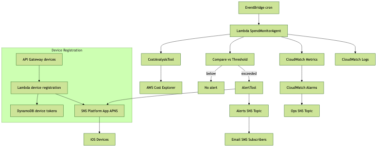

# FinOps AI Agent

[](https://www.typescriptlang.org/)
[](https://aws.amazon.com/)
[](https://nodejs.org/)
[](https://jestjs.io/)

An enterprise-grade AI agent built with AWS Strands framework that provides comprehensive AWS cost monitoring, iOS device management, multi-channel alerting, and automated operational recovery.

## 🚀 Quick Start

```bash
# Install dependencies
npm install

# Validate configuration
npm run validate:config

# Deploy to AWS
npm run deploy

# Run tests
npm run test:all
```

## 📋 Overview

This FinOps AI Agent is a production-ready platform that combines:

- **🧠 Intelligent Cost Monitoring** - AI-powered AWS spend analysis with trend detection
- **📱 iOS Device Management** - Complete APNS integration with device lifecycle management
- **🔔 Multi-Channel Alerting** - Email, SMS, and iOS push notifications with intelligent fallback
- **🔧 Automated Recovery** - Self-healing capabilities with comprehensive health monitoring
- **📊 Enterprise Observability** - Full metrics, logging, and operational dashboards

### Key Capabilities

- **AWS Strands Framework** - Enterprise-grade AI agent orchestration
- **Cost Intelligence** - Smart spending analysis with anomaly detection
- **Mobile Infrastructure** - Complete iOS notification platform
- **Operational Excellence** - Health checks, automated recovery, and comprehensive monitoring
- **Enterprise Security** - Zero-trust architecture with audit trails

## 🏗️ Architecture

High-level data flow from scheduled analysis to multi-channel alerts, device registration, and observability.



Source for updates: `docs/architecture.mmd`. Regenerate with `npm run diagram:build`.

## 🛠️ Features

### Cost Management & Intelligence
- **Smart Threshold Monitoring** - Configurable spending limits with AI-powered anomaly detection
- **Service Attribution** - Detailed cost breakdown by AWS service (EC2, S3, Lambda, etc.)
- **Predictive Analytics** - Monthly cost projections based on usage patterns
- **Multi-Region Support** - Cost analysis across multiple AWS regions
- **Alert Levels** - WARNING and CRITICAL alerts based on spending severity

### iOS Device Management Platform
- **APNS Integration** - Complete Apple Push Notification service platform
- **Device Registration API** - Secure device token registration with validation
- **Certificate Management** - Automatic APNS certificate health monitoring
- **Token Lifecycle** - Automated cleanup of invalid/expired device tokens
- **Feedback Processing** - APNS feedback service integration for optimal delivery

### Multi-Channel Alerting
- **SNS Integration** - Reliable email and SMS delivery through AWS
- **iOS Push Notifications** - Native mobile alerts with rich content
- **Intelligent Fallback** - Automatic fallback when primary channels fail
- **Custom Templates** - Configurable alert formatting and content

### Enterprise Operations
- **Health Monitoring** - Comprehensive system health validation
- **Automated Recovery** - Self-healing for common configuration issues
- **Performance Metrics** - Real-time execution monitoring and analytics
- **Audit Trails** - Complete operational history for compliance
- **Progress Tracking** - Real-time task execution monitoring

## 📦 Installation & Setup

### Prerequisites
- **Node.js** 18+ and npm
- **AWS CLI** configured with appropriate permissions
- **AWS CDK** v2.100.0+
- **TypeScript** 5.0+

### Dependencies Installation
```bash
# Clone the repository
git clone <repository-url>
cd FinOps-AIAgent

# Install all dependencies
npm install

# Build the project
npm run build
```

### AWS Configuration
Ensure your AWS credentials are configured with the following minimum permissions:
- `costexplorer:GetRightsizingRecommendation`
- `costexplorer:GetCostAndUsage`
- `sns:CreatePlatformEndpoint`
- `sns:DeleteEndpoint`
- `sns:Publish`
- `cloudwatch:PutMetricData`
- `logs:CreateLogGroup`
- `logs:CreateLogStream`
- `logs:PutLogEvents`

## 🚀 Deployment

### Basic Deployment
```bash
# Validate configuration before deployment
npm run validate:config
npm run validate:pre-deploy

# Deploy infrastructure
npm run deploy
# or: cdk deploy

# Validate deployment success
npm run validate:deployment
```

### iOS Configuration (Optional)
For iOS push notification support:

```bash
# Validate iOS/APNS configuration
npm run validate:ios

# Test device registration API
npm run test:device-api
```

Required iOS configuration:
- APNS certificate uploaded to AWS SNS
- Platform Application ARN configured
- Bundle ID matching your iOS application

### Environment Variables
```bash
# Required
AWS_REGION=us-east-1
SPEND_THRESHOLD=10.00
SNS_TOPIC_ARN=arn:aws:sns:us-east-1:123456789012:cost-alerts

# Optional (for iOS)
IOS_PLATFORM_APPLICATION_ARN=arn:aws:sns:us-east-1:123456789012:app/APNS/YourApp
IOS_BUNDLE_ID=com.yourcompany.yourapp
```

## 🧪 Testing

### Test Suites
```bash
# Unit tests (fast, no AWS dependencies)
npm run test:unit

# Integration tests (requires AWS credentials)
npm run test:integration:setup
npm run test:integration:run

# iOS-specific integration tests
npm run test:integration:ios

# Performance tests
npm run test:performance

# Run all tests
npm run test:all
```

### Local Testing
```bash
# Test the agent locally
npm run test:local

# Test device registration API
npm run test:device-api
```

### Validation Scripts
```bash
# Validate all configuration
npm run validate:all

# Individual validation steps
npm run validate:config        # Configuration validation
npm run validate:pre-deploy    # Pre-deployment checks
npm run validate:ios          # iOS/APNS configuration
npm run validate:deployment   # Post-deployment validation
```

## ⚙️ Configuration

### Basic Configuration
```typescript
// src/config/agent-config.ts
export const config: SpendMonitorConfig = {
  region: 'us-east-1',
  spendThreshold: 10.00,           // Alert threshold in USD
  checkPeriodDays: 30,            // Cost analysis period
  snsTopicArn: 'arn:aws:sns:...',
  retryAttempts: 3,
  minServiceCostThreshold: 0.01,

  // Optional iOS configuration
  iosConfig: {
    platformApplicationArn: 'arn:aws:sns:...',
    bundleId: 'com.yourcompany.yourapp'
  }
};
```

### Advanced Configuration Options

#### Cost Monitoring
- **Spend Thresholds**: Multiple threshold levels with different alert severities
- **Service Filtering**: Monitor specific AWS services or exclude development costs
- **Regional Analysis**: Multi-region cost analysis and reporting
- **Time Periods**: Configurable analysis periods (daily, weekly, monthly)

#### Notification Channels
- **Multi-Channel Delivery**: Email, SMS, and iOS push notifications
- **Fallback Strategy**: Automatic fallback when primary channels fail
- **Alert Formatting**: Custom message templates with cost breakdowns
- **Delivery Scheduling**: Time-based delivery preferences

#### Enterprise Features
- **Health Monitoring**: Configurable health check intervals and thresholds
- **Automated Recovery**: Self-healing actions for common issues
- **Metrics Collection**: Custom CloudWatch metrics and dashboards
- **Audit Logging**: Detailed execution logs for compliance

## 📊 Monitoring & Operations

### CloudWatch Integration
The agent automatically creates and populates custom CloudWatch metrics:
- `SpendMonitor/Agent/ExecutionSuccess`
- `SpendMonitor/Agent/ExecutionDuration`
- `SpendMonitor/iOS/NotificationDelivery`
- `SpendMonitor/iOS/TokenValidation`
- `SpendMonitor/Health/ComponentStatus`

### Health Monitoring
Built-in health checks monitor:
- ✅ Cost Explorer API connectivity
- ✅ SNS topic accessibility
- ✅ APNS certificate validity
- ✅ Device token health
- ✅ Overall system status

### Automated Recovery
The system automatically recovers from:
- Invalid device token cleanup
- APNS configuration refresh
- Temporary service connectivity issues
- Certificate expiration warnings

## 🔒 Security

### Security Architecture
- **Least Privilege IAM** - Minimal permissions with read-only Cost Explorer access
- **Zero Secrets Storage** - No sensitive data stored in code or configuration
- **Encrypted Communications** - All AWS communications use TLS encryption
- **Audit Trails** - Complete CloudWatch logging for all operations

### Data Privacy
- **No Cost Data Storage** - Cost information analyzed in memory only
- **Device Token Security** - iOS tokens encrypted and managed through AWS SNS
- **Minimal Data Collection** - Only essential operational metrics collected
- **Regional Compliance** - Deployable in any AWS region for data sovereignty

### APNS Security
- **Certificate Validation** - Automatic APNS certificate health monitoring
- **Token Validation** - Device token format validation and lifecycle management
- **Secure Communication** - Direct encrypted communication with Apple's APNS

## 📚 Documentation

- **[Complete Project Overview](./FinOps-AIAgent.md)** - Comprehensive project documentation
- **[Architecture Details](./CLAUDE.md)** - Technical architecture for developers
- **[API Examples](./examples/)** - Code examples and usage patterns
- **[Task Implementation Summary](./TASK_15_IMPLEMENTATION_SUMMARY.md)** - Development history

## 🤝 Contributing

### Development Workflow
1. **Code Quality**: All code must pass ESLint and TypeScript compilation
2. **Testing**: Unit tests required for all new functionality
3. **Integration Testing**: AWS integration tests for service interactions
4. **Documentation**: Update documentation for new features

### Code Standards
```bash
# Lint code
npm run lint

# Build and type check
npm run build

# Validate all changes
npm run validate:all
```

## 📄 License

MIT License - see [LICENSE](./LICENSE) file for details.

## 🆘 Support & Troubleshooting

### Common Issues

**Issue**: Cost Explorer permissions denied
```bash
# Solution: Ensure IAM user/role has Cost Explorer read permissions
aws iam attach-user-policy --user-name your-user --policy-arn arn:aws:iam::aws:policy/AWSBillingReadOnlyAccess
```

**Issue**: iOS notifications not working
```bash
# Solution: Validate APNS configuration
npm run validate:ios
npm run test:device-api
```

**Issue**: Agent execution failures
```bash
# Solution: Check CloudWatch logs
aws logs filter-log-events --log-group-name /aws/lambda/spend-monitor-agent
```

### Getting Help
- Check [CloudWatch logs] for detailed error information
- Review [configuration validation] output for setup issues
- Run [health checks] to diagnose system status
- Examine [metrics dashboards] for performance insights

---

**Built with ❤️ using AWS Strands Framework | Enterprise-Ready FinOps Automation**
