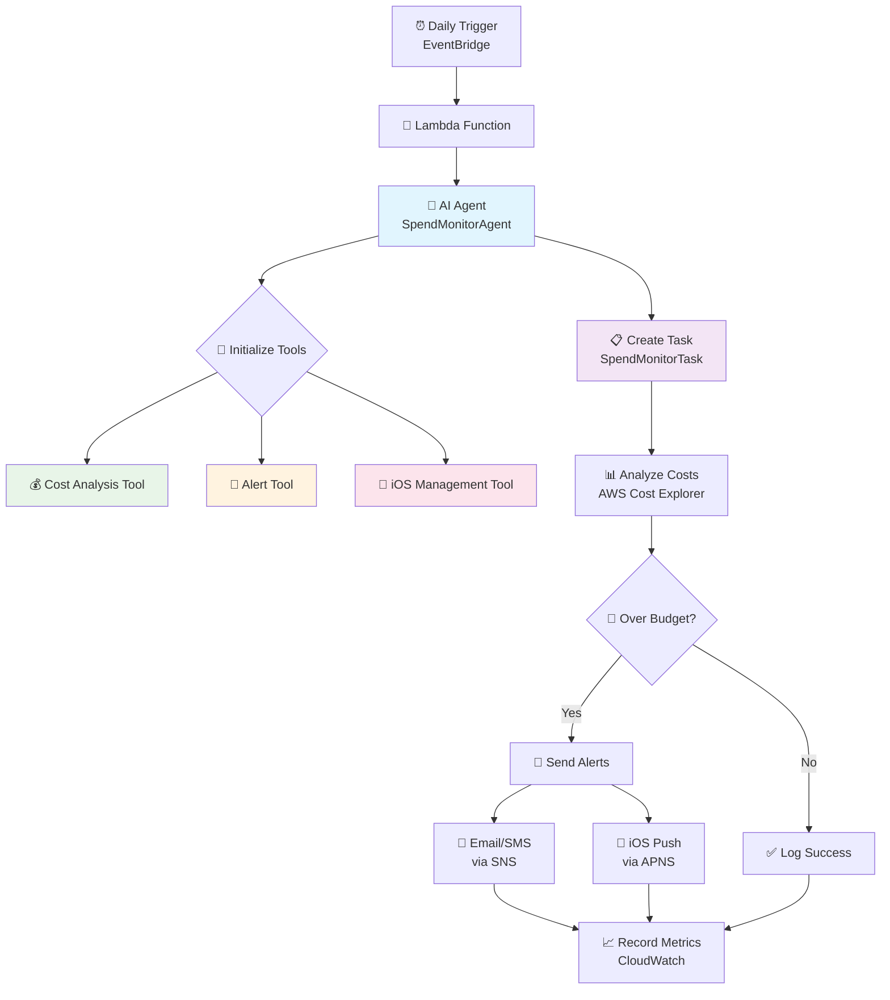
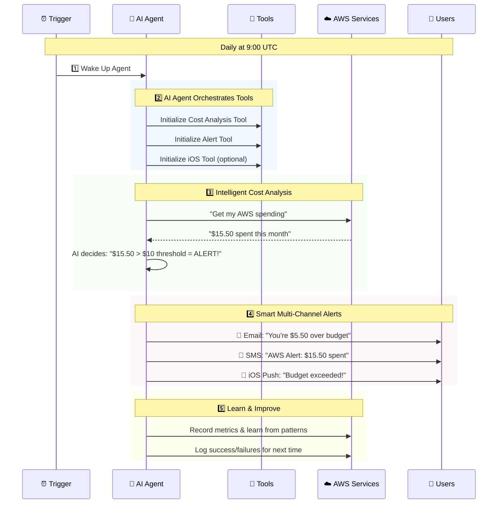
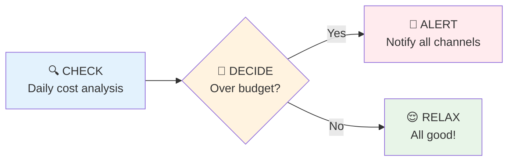

# FinOps AI Agent - Simplified Workflow

## Core AI Agent Architecture



## 🤖 AI Agent Workflow (5 Steps)



## 🧠 What Makes It "AI Agent"?

### **1. Autonomous Decision Making**
- **Thinks**: Analyzes spending patterns automatically
- **Decides**: Determines alert urgency (WARNING vs CRITICAL)
- **Acts**: Sends appropriate notifications without human intervention

### **2. Intelligent Tool Orchestration**
```
🤖 Agent Brain:
├── 💰 Cost Analysis Tool → "What did we spend?"
├── 📢 Alert Tool → "How should I notify them?"
└── 📱 iOS Tool → "Can I reach their phone?"
```

### **3. Self-Healing & Learning**
- **Adapts**: If iOS fails → automatically tries email/SMS
- **Recovers**: If AWS API fails → retries with smart backoff
- **Learns**: Tracks what works best for future decisions

## 🔄 Simple 3-Step Process



## 🎛️ Core Components

| Component | Role | AI Capability |
|-----------|------|---------------|
| **🤖 SpendMonitorAgent** | Brain/Orchestrator | Decides what tools to use when |
| **💰 CostAnalysisTool** | Data Collector | Smart retry logic, projection calculations |
| **📢 AlertTool** | Communicator | Adaptive message formatting per channel |
| **📱 iOSManagementTool** | Mobile Specialist | Health monitoring, automatic recovery |
| **📋 SpendMonitorTask** | Process Manager | Progress tracking, error recovery |

## 🚀 Why This Architecture Works

### **Event-Driven & Serverless**
- Runs only when needed (daily)
- Scales automatically
- Costs almost nothing when idle

### **AI-Powered Intelligence**
- Makes smart decisions about alert urgency
- Adapts to delivery failures automatically
- Learns from patterns for better performance

### **Multi-Channel Resilience**
- Primary: iOS push notification
- Backup: Email alerts
- Fallback: SMS messages
- Always gets through to users

### **AWS-Native Integration**
- Uses AWS Cost Explorer for real spending data
- Leverages SNS for reliable message delivery
- CloudWatch for comprehensive monitoring

## 🎯 Real-World Example

```
Day 1: Agent checks → $8 spent → Under $10 budget → ✅ Silent
Day 2: Agent checks → $12 spent → Over $10 budget → 🚨 Alert!

Agent thinking: "This is 20% over budget, send WARNING level alert"
↓
📧 Email: Detailed spending breakdown with charts
📱 SMS: "AWS Alert: $12 spent, $2 over budget"
🍎 iOS: Push with spending details and top services
```

This simplified architecture shows how the AI agent autonomously monitors, decides, and acts - making it a true "agentic" system that requires minimal human intervention while providing intelligent financial operations monitoring.